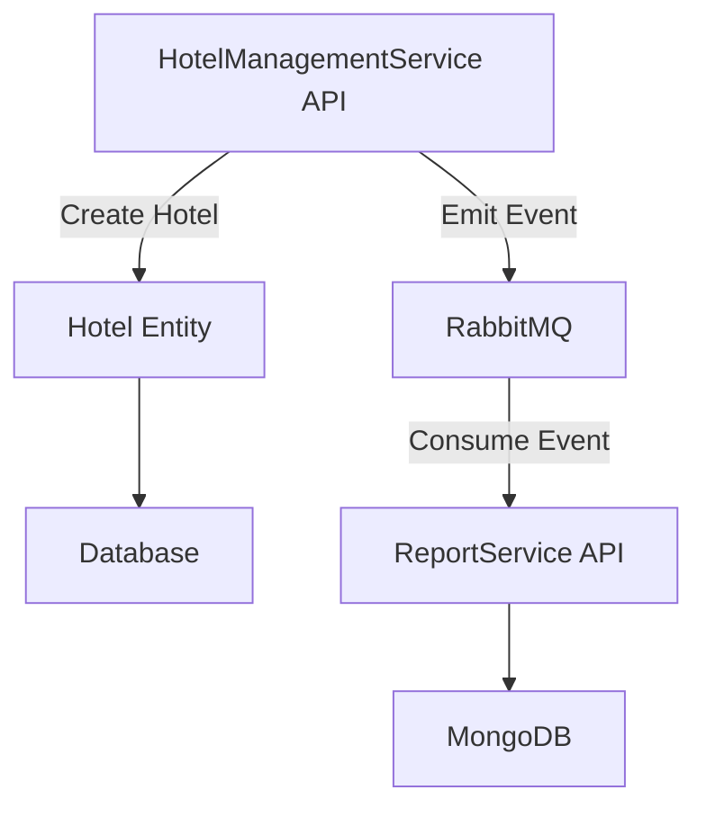

# Hotel Management and Reporting System

This project is a microservices-based application designed to manage hotel data and generate reports. It follows principles of Domain-Driven Design (DDD), Clean Architecture, and Event-Driven Architecture. The system consists of two main services:

1. **HotelManagementService**: Manages hotel information, including contact details and responsible personnel.
2. **ReportService**: Generates reports based on hotel data, using event-driven communication for updating reports asynchronously.

## Technologies Used

- **.NET 8** for API development
- **Entity Framework Core** for data access
- **MongoDB** for report storage in `ReportService`
- **RabbitMQ** for event-driven communication
- **Docker** for containerization
- **XUnit** for unit testing

## Architecture

### Clean Architecture
The project is divided into four main layers:
1. **Domain**: Contains core business logic and entities, such as `Hotel` and `Report`.
2. **Application**: Implements use cases and business rules.
3. **Infrastructure**: Handles external concerns like database access and messaging.
4. **API**: Exposes endpoints for interaction with the system.

### Domain-Driven Design (DDD)
- **Aggregate Roots**: `Hotel` in `HotelManagementService` and `Report` in `ReportService` act as aggregate roots, encapsulating related entities.
- **Value Objects**: Used for encapsulating immutable data like addresses.
- **Domain Events**: `HotelCreatedEvent` and `ReportCreatedEvent` decouple operations and trigger workflows.

### Event-Driven Architecture
RabbitMQ is used for asynchronous communication:
- When a report is requested, `ReportService` emits an event and updates the report upon receiving hotel statistics.

## Design Patterns

- **Repository Pattern**: Abstracts data access in `Infrastructure`.
- **Factory Pattern**: Ensures consistent creation of domain objects.
- **Event Sourcing**: Tracks domain events like `ReportCreatedEvent`.
- **Dependency Injection**: Configured across layers to promote testability and maintainability.

## Usage Instructions

### Prerequisites
- Install [Docker](https://www.docker.com/) and [Docker Compose](https://docs.docker.com/compose/).
- Ensure .NET SDK is installed.

### Running the Application
1. Clone the repository:
   ```bash
   git clone https://github.com/oguzhantomak/HotelGuide
   cd HotelGuide
   ```
2. Build and run services using Docker Compose:
   ```bash
   docker-compose up --build
   ```
3. Access the API:
   - `HotelManagementService`: `http://localhost:5001`
   - `ReportService`: `http://localhost:5002`

### Running Tests
Navigate to the test projects and run tests:
```bash
cd src/HotelManagementService/HotelManagementService.Tests
dotnet test
```

## Workflow Diagram



## License
This project is licensed under the MIT License. See `LICENSE.txt` for details.
